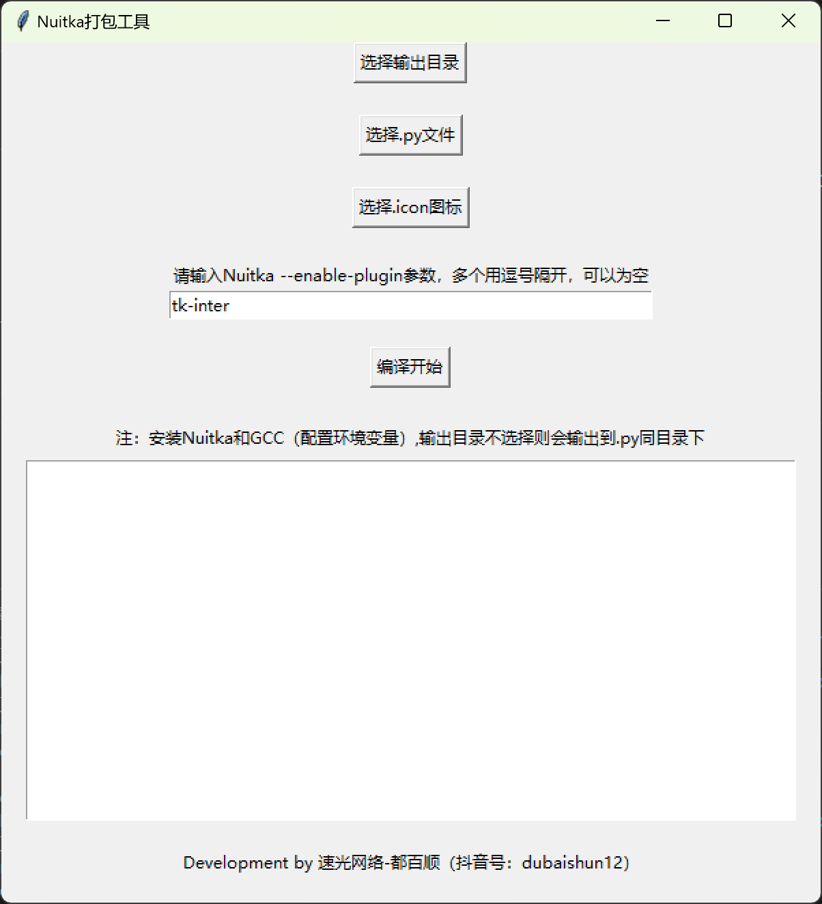

# Nuitka 打包工具 GUI

一个基于 Python 和 Tkinter 开发的图形化界面工具，用于简化使用 Nuitka 编译 Python 脚本的过程。

## 功能特点

- 可视化选择 Python 主文件
- 可选择自定义图标文件 (.ico)
- 可指定输出目录（默认为 Python 文件所在目录）
- 支持配置 Nuitka 插件参数
- 实时显示编译进度和输出信息
- 一键编译生成独立可执行文件

## 系统要求

- Windows 操作系统（推荐）
- Python 3.6 或更高版本
- 已安装 Nuitka 和 GCC 编译器

## 安装依赖

在使用本工具前，请确保已安装以下组件：

1. 安装 Nuitka：
   ```
   pip install nuitka
   ```

2. 安装 GCC 编译器（推荐使用 MinGW-w64）并配置环境变量，这里一定要安装好，一般使用Python官网下载安装包 并设置环境变量，即可安装好GCC.

## 使用方法

1. 运行程序：
   ```
   python nuitka_gui_tool.py
   ```

2. 界面操作：
   - 点击"选择输出目录"按钮指定输出位置（可选）
   - 点击"选择.py文件"按钮选择要编译的Python主文件
   - 点击"选择.icon图标"按钮指定应用程序图标（可选）
   - 在输入框中配置Nuitka插件参数（多个插件用逗号分隔）
   - 点击"编译开始"按钮启动编译过程

3. 查看进度：
   - 编译过程中的输出信息会实时显示在底部文本框中
   - 编译完成后会弹出成功或错误提示

## 注意事项

- 输出目录不选择时，默认输出到.py文件同目录下
- 确保已正确安装Nuitka和GCC并配置好环境变量
- 编译过程可能需要较长时间，请耐心等待

## 软件界面


## 技术支持

- **速光网络软件开发**
- 官网：suguang.cc
- 联系电话/微信：15120086569
- 抖音号：dubaishun12

## 版权信息

Copyright © 2025 速光网络软件开发. All rights reserved.

---
*关注我们的抖音账号获取最新更新和技术支持！*